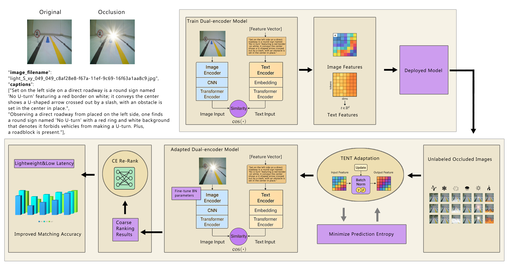

[README.md](https://github.com/user-attachments/files/28538918/README.md)
# Occlusion-Aware Test-Time Adaptation for Robust Traffic Sign Image-Text Matching

This repository contains the research code and representative assets for the
manuscript:

**Occlusion-Aware Test-Time Adaptation for Robust Traffic Sign Image-Text Matching**

The project studies robust traffic-sign image-text matching under adverse
occlusion conditions. The code includes the main occlusion-aware test-time
adaptation evaluation script, comparison/ablation scripts, visualization tools,
manuscript figures, and representative occlusion masks.



## Repository Contents

```text
scripts/
  evaluate_oata_tent.py              Main OATA/TENT evaluation and sweep script
  evaluate_tast.py                   TAST comparison script
  evaluate_baseline_occlusion.py     Baseline occlusion evaluation helper
  rename_metadata_paths.py           Metadata path utility

ablations/
  evaluate_ce_rerank.py
  evaluate_eata.py
  evaluate_fetta.py
  evaluate_mean_teacher_eata.py
  evaluate_memo.py
  evaluate_occlusion_invariance_entropy.py
  evaluate_roid.py
  evaluate_sam_selective_bn.py
  evaluate_sar.py
  evaluate_t3a.py
  evaluate_tcr.py
  evaluate_tda.py

visualization/
  gradcam/                           Grad-CAM and heatmap scripts
  tsne/                              t-SNE visualization scripts
  failcases/                         Failure-case export scripts

figures/                             Main manuscript figures
occlusion_masks/                     Representative synthetic occlusion masks
data/                                Local dataset placeholder
checkpoints/                         Local checkpoint placeholder
results/                             Local output placeholder
```

## Setup

Python 3.9 or newer is recommended.

```bash
python -m venv .venv
source .venv/bin/activate
pip install -r requirements.txt
```

The reference model factory is provided in `model_architecture.py`. If your
checkpoint was trained with a different internal module naming scheme, adjust
that file or load the checkpoint with compatible key mapping.

## Data And Checkpoints

Large datasets and trained model checkpoints are not tracked in Git. Before
running the evaluation scripts, place files in the following layout:

```text
data/
  val_images/
  occluded_images/
  val_metadata.json
checkpoints/
  model_best.pth.tar
```

Each metadata item should include `image_path`, `captions` or `caption`, and
`category`. See `data/README.md` and `DATA_AVAILABILITY.md` for details.

## Main Evaluation

Run a single OATA/TENT evaluation:

```bash
python scripts/evaluate_oata_tent.py \
  --model_path checkpoints/model_best.pth.tar \
  --dataset_path data/occluded_images \
  --metadata_path data/val_metadata.json \
  --output_dir results/oata_single \
  --single \
  --use_occ \
  --use_ent
```

Run the parameter sweep used for sensitivity analysis:

```bash
python scripts/evaluate_oata_tent.py \
  --model_path checkpoints/model_best.pth.tar \
  --dataset_path data/occluded_images \
  --metadata_path data/val_metadata.json \
  --output_dir results/oata_sweep
```

The ablation scripts are provided as research scripts corresponding to the
reported comparison methods. Some scripts expose top-level configuration
variables; edit those variables when running a specific baseline.

## Metrics

`utils.py` computes image-to-text retrieval metrics including Recall@1,
Recall@5, Recall@10, and mAP. When category labels are available, samples with
the same category are treated as positives; otherwise, one-to-one image/text
pairs are used.

## Notes For Reviewers

This repository is intended to support manuscript review by making the code
logic, occlusion processing assets, visualization scripts, and reported figure
materials inspectable. Full image data and trained checkpoints are not included
because of storage and access constraints.

